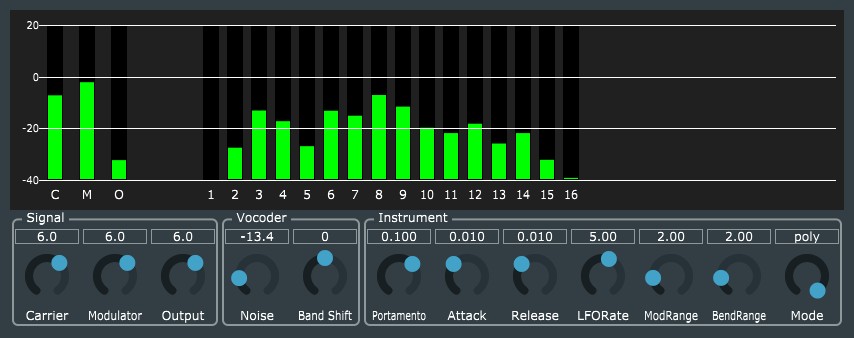

# ChannelVocoder
 
 

## これ何ですか

クラシックなチャネルボコーダのエフェクタです。オーディオプラグインまたはスタンドアロンの形式で動作します。  
JUCE frameworkを利用しています。

## ビルドの道具立て

* JUCE framework: [ダウンロードページ](https://juce.com/get-juce/download)または[githubリポジトリ](https://github.com/juce-framework/JUCE)からダウンロードできます。
* Projucer: JUCE frameworkを使ったC++プロジェクトを生成するツールです。[Projucerページ](https://juce.com/discover/projucer)から実行可能なバイナリをダウンロードできますが、JUCE frameworkに同梱のソースを自分でビルドしても良いです。
* ASIO SDK (optional): Windows版のスタンドアロン形式でASIOを有効化できます。[デベロッパページ](https://www.steinberg.net/developers/)からダウンロードできます。
* C++ビルドツール: Visual Studio 2017～2022、Xcodeなど、目的のターゲットプラットフォームに合わせたもの。

JUCEが対応するプラットフォーム、バイナリ形式、ライセンスについては[JUCE](https://juce.com/)で確認してください。

## ビルドの道のり

1. Projucerで.jucerファイルを開く。
2. Modulesセクションにおいて、ビルド環境に合わせてmoduleパスを修正する。
3. Exporterセクションにおいて、目的のターゲットプラットフォームを追加する。
4. File|Save ProjectメニューでC++プロジェクトを書き出す。
5. Buildsフォルダ下に書き出されたC++プロジェクトをビルドする。

当方では以下の環境でコードを書き、動作を確認しています。
* Windows 11 Pro
* Visual Studio 2022
* JUCE framework 7.0.1
* プラグインホスト: JUCE frameworkに同梱のAudioPluginHostアプリケーション
* VST3、スタンドアロン形式のビルド

MacやLinux、AUやLV2でもビルドできると思います。(要確認)

## 動作

  
**fig1. チャネルボコーダのブロックダイアグラム**

キャリアに楽器音、モジュレータに声を入力し、それぞれ1/3 oct.フィルタバンクで16の帯域チャネルに分割します。それぞれの帯域チャネルではモジュレータの音量でキャリアのゲインを制御します。帯域チャネルの出力をミックスし、結果的にモジュレータのスペクトルの輪郭がキャリアに反映します。

## 使い方

プラグインやプラグインホストの基本的な知識については、ここでは省きます。

* キャリア入力に楽器音、モジュレータ入力に声の音声ソースをそれぞれ入力して「喋る楽器音」を生成します。
* キャリアには外部入力の他に、BLITパルスオシレータを使った簡単な音源を備えておりMIDI入力で演奏出来ます。
* サ行の歯擦音を強調するために高域チャネルにホワイトノイズを混入できます。

## 作者

[yu2924](https://twitter.com/yu2924)

## ライセンス

MIT License
